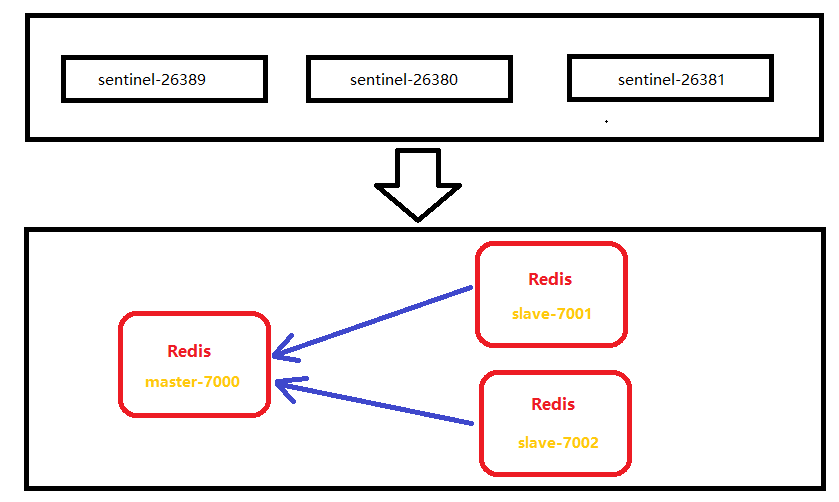

# Redis Sentinel （哨兵模式） 搭建

Redis哨兵模式是基于Redis主从方案实现的

#### 前提概要

- Redis高可以用有三种常用配置方式:
    
    1. Redis自带主从配置，可以直接实现，多机器为从，只读，master可写
        - 主节点Master可读、可写.
        
        - 从节点Slave只读。（read-only）
        
        > 主从模型可以提高读的能力，在一定程度上缓解了写的能力。因为能写仍然只有Master节点一个，
        >可以将读的操作全部移交到从节点上，变相提高了写能力
    
    2. Redis Sentinel
        
        主从配置是存在缺陷的，因为从机器或主机器是会出现宕机的，此时某个节点将无法访问，这时候业务某一部分将会引发无法访问甚至影响业务访问，损失巨大。
        而哨兵模式正是为了解决这一问题而生的。

- 说明

> Redis Sentinel 属于主从备份的范畴，主从数据同步使用的是redis自带的主从配置，不同的是sentinel是在此基础上加入的故障检测和转移，防止Redis单点故障。

友情提示： 哨兵模式是redis一个架构模式，但业务使用该架构是需要业务代码端实现的，不能直接连接redis，而是链接redis的哨兵端口
哨兵检查redis节点并返回正确的哨兵连接的Redis节点链接配置，有业务端根据链接创建Redis进程池或TCP握手进程。

Redis主从复制是直接通过tcp进行数据交流的，不是像mysql的文件复制。


#### 最终的目标

- 架构图



<sub>Redis Sentinel 最终搭建目标架构图</sub>

##### 实现功能点

- Setinel 集群
- Redis 主从复制
- Sentinel 集群实现 Redis 高可用（故障自动转移）

##### redis sentinel 配置

- **redis sentinel 节点1**：redis-sentinel-26379.conf

  - 新建 redis-sentinel-26379.conf
  
  > 可从 /urs/redis/redis-sentinel.conf 复制到 /urs/redis/config/redis-sentinel.conf 
  > 在config 目录下执行 `cp ../redis-sentinel.conf ./redis-sentinel-26379.conf `

  - 修改配置 redis-sentinel-26379.conf：

    ```
    port 26379
    daemonize yes
    pidfile /var/run/redis-sentinel-26379.pid
    logfile "redis-sentinel-26379.log"
    # 监控节点，且超过2个sentinel 任务故障，方可执行故障转移
    sentinel monitor mymaster 127.0.0.1 7000 2
    # 如果节点在 30000毫秒内未回应，就认为故障
    sentinel down-after-milliseconds mymaster 30000
    # 如果故障转移后，同时进行主从复制数为 1
    sentinel parallel-syncs mymaster 1
    # 故障转移的超时时间
    sentinel failover-timeout mymaster 180000
    sentinel deny-scripts-reconfig yes
    ```

- **redis sentinel 节点2**：redis-sentinel-26380.conf

  - 创建 `touch redis-sentinel-26380.conf`

  - 修改配置 redis-sentinel-26380.conf：

    ```properties
    port 26380
    daemonize yes
    pidfile /var/run/redis-sentinel-26380.pid
    logfile "redis-sentinel-26380.log"
    
    # 监控节点，且超过2个sentinel 任务故障，方可执行故障转移
    sentinel monitor mymaster 127.0.0.1 7000 2
    # 如果节点在 30000毫秒内未回应，就认为故障
    sentinel down-after-milliseconds mymaster 30000
    # 如果故障转移后，同时进行主从复制数为 1
    sentinel parallel-syncs mymaster 1
    # 故障转移的超时时间
    sentinel failover-timeout mymaster 180000
    sentinel deny-scripts-reconfig yes
    ```
    
- **redis sentinel 节点3**：redis-sentinel-26381.conf


  - 创建 ` touch redis-sentinel-26381.conf `

    ```
    port 26381
    daemonize yes
    pidfile /var/run/redis-sentinel-26381.pid
    logfile "redis-sentinel-26381.log"
    
    # 监控节点，且超过2个sentinel 任务故障，方可执行故障转移
    sentinel monitor mymaster 127.0.0.1 7000 2
    # 如果节点在 30000毫秒内未回应，就认为故障
    sentinel down-after-milliseconds mymaster 30000
    # 如果故障转移后，同时进行主从复制数为 1
    sentinel parallel-syncs mymaster 1
    # 故障转移的超时时间
    sentinel failover-timeout mymaster 180000
    sentinel deny-scripts-reconfig yes
    ```

##### 启动 redis sentinel

- 启动命令：	

  ```shell
  
  ./src/redis-sentinel ./config/redis-sentinel-26379.conf
  ./src/redis-sentinel ./config/redis-sentinel-26380.conf
  ./src/redis-sentinel ./config/redis-sentinel-26381.conf
  
  redis-sentinel redis-sentinel-26379.conf
  redis-sentinel redis-sentinel-26380.conf
  redis-sentinel redis-sentinel-26381.conf
  ```

- 验证：`ps -ef | grep redis-sentinel`

- `./src/redis-cli -p 26379 info sentinel`


至此 Redis 主从和 Redis Sentinel 已经搭建完成了。接下来验证故障转移。

### 故障转移演示

#### laravel5.5以上配置使用哨兵模式

```

//配置文件`config/database.php`
 'redis' => [
    'client' => 'predis',	//指示redis客户端使用的是predis组件

    'default' => [
        'tcp://127.0.0.1:26379',
        'tcp://127.0.0.1:26381',
        'tcp://127.0.0.1:26382',    //这3个都是sentinel节点的地址
        'options' => [
            'replication' => 'sentinel',
            'service'     => env('REDIS_SENTINEL_SERVICE', 'mymaster'),    //sentinel
            'parameters'  => [
                'password' => env('REDIS_PASSWORD', null),    //redis的密码,没有时写null
                'database' => 0,
            ],
        ],
    ],
 ],

```

编写命令并使用

php artisan test

```php

$redis = new \Illuminate\Support\Facades\Redis();

    while (true) {
        sleep(1);
        try {
            $redis::set($key='test_sentinel:' . time(), 1);
            echo $redis::get($key);
        } catch (Exception $e) {
            echo $e->getMessage();
        }
        echo "\n";
    }

```


#### 编写 Java 客户端

   ```java
   package dddy.gin.practice;
   
   import lombok.extern.slf4j.Slf4j;
   import redis.clients.jedis.Jedis;
   import redis.clients.jedis.JedisSentinelPool;
   
   import java.util.HashSet;
   import java.util.Random;
   import java.util.Set;
   import java.util.concurrent.TimeUnit;
   
   /**
    * 演示故障转移
    */
   @Slf4j
   public class RedisSentinelFailOver {
       private static final String MASTER_NAME = "mymaster";
   
       public static void main(String[] args) {
           Set<String> sentinels = new HashSet<>();
           sentinels.add("127.0.0.1:26379");
           sentinels.add("127.0.0.1:26380");
           sentinels.add("127.0.0.1:26381");
           JedisSentinelPool sentinelPool = new JedisSentinelPool(MASTER_NAME, sentinels);
   
           while (true) {
               Jedis jedis = null;
   
               try {
                   TimeUnit.MILLISECONDS.sleep(1000);
                   jedis = sentinelPool.getResource();
                   int index = new Random().nextInt(100000);
                   String key = "k-" + index;
                   String value = "v-" + index;
                   jedis.set(key, value);
                   log.info("{} value is {}", key, value);
               } catch (Exception e) {
                   log.warn(e.getMessage());
               } finally {
                   if (jedis != null)
                       jedis.close();
               }
           }
   
       }
   }
   ```

2. 查看当前 Redis 集群的主节点 `redis-cli -p 26379 info`


3. 启动 Java 客户端（这里可能报错，如果有错误请查看本文最后“可能出现的问题”）


4. 模拟主节点意外宕机（通过`redis-cli -p 7000 info server`查看进程id，在通过 `kill -9 进程id`）

5. 查看 Java 客户端日志

6. 等待 Redis Sentinel 故障转移完成

7. 查看当前 Redis 集群的主节点 `redis-cli -p 26379 info`,已经转移了主节点到7001（或者7002）


至此，整个故障转移已经演示完毕。

### 可能出现的问题

- **未安装 gcc**

  - 现象：

    ```shell
    MAKE hiredis
    cd hiredis && make static
    make[3]: 进入目录“/usr/redis-5.0.8/deps/hiredis”
    gcc -std=c99 -pedantic -c -O3 -fPIC  -Wall -W -Wstrict-prototypes -Wwrite-strings -g -ggdb  net.c
    make[3]: gcc：命令未找到
    make[3]: *** [net.o] 错误 127
    make[3]: 离开目录“/usr/redis-5.0.8/deps/hiredis”
    make[2]: *** [hiredis] 错误 2
    make[2]: 离开目录“/usr/redis-5.0.8/deps”
    make[1]: [persist-settings] 错误 2 (忽略)
        CC adlist.o
    /bin/sh: cc: 未找到命令
    make[1]: *** [adlist.o] 错误 127
    make[1]: 离开目录“/usr/redis-5.0.8/src”
    make: *** [all] 错误 2
    ```

  - 原因：Redis 是 C 语言开发，编译，安装之前必先确认是否安装 gcc 环境（gcc -v） 

  - 解决方法：安装 gcc 。`yum install -y gcc `


- **分配器allocator， 中MALLOC  这个 环境变量选择的默认库导致的** 


    - 现象：
    
      ```shell
      cd src && make all
      make[1]: 进入目录“/usr/redis-5.0.8/src”
          CC Makefile.dep
      make[1]: 离开目录“/usr/redis-5.0.8/src”
      make[1]: 进入目录“/usr/redis-5.0.8/src”
          CC adlist.o
      In file included from adlist.c:34:0:
      zmalloc.h:50:31: 致命错误：jemalloc/jemalloc.h：没有那个文件或目录
       #include <jemalloc/jemalloc.h>
                                     ^
      编译中断。
      ```

    -  原因：分配器，默认的是 jemalloc ，而你的环境jemalloc ，而只有 libc。
    -  解决：手动选择分配器。`make` 替换为 `make MALLOC=libc` 即可。

-  Jedis 中的保护模式

   -  现象

      ```shell
      [main] INFO redis.clients.jedis.JedisSentinelPool - Redis master running at 127.0.0.1:7000, starting Sentinel listeners...
      [main] INFO redis.clients.jedis.JedisSentinelPool - Created JedisPool to master at 127.0.0.1:7000
      [main] WARN dddy.gin.practice.RedisSentinelFailOver - DENIED Redis is running in protected mode because protected mode is enabled, no bind address was specified, no authentication password is requested to clients. In this mode connections are only accepted from the loopback interface. If you want to connect from external computers to Redis you may adopt one of the following solutions: 1) Just disable protected mode sending the command 'CONFIG SET protected-mode no' from the loopback interface by connecting to Redis from the same host the server is running, however MAKE SURE Redis is not publicly accessible from internet if you do so. Use CONFIG REWRITE to make this change permanent. 2) Alternatively you can just disable the protected mode by editing the Redis configuration file, and setting the protected mode option to 'no', and then restarting the server. 3) If you started the server manually just for testing, restart it with the '--protected-mode no' option. 4) Setup a bind address or an authentication password. NOTE: You only need to do one of the above things in order for the server to start accepting connections from the outside.
      [main] WARN dddy.gin.practice.RedisSentinelFailOver - java.net.SocketException: Software caused connection abort: recv failed
      ```

   -  原因：redis 中没有关闭保护模式

   -  解决：在 redis 中，添加多一个配置 `protected-mode no`，然后重新启动 redis 服务
   
