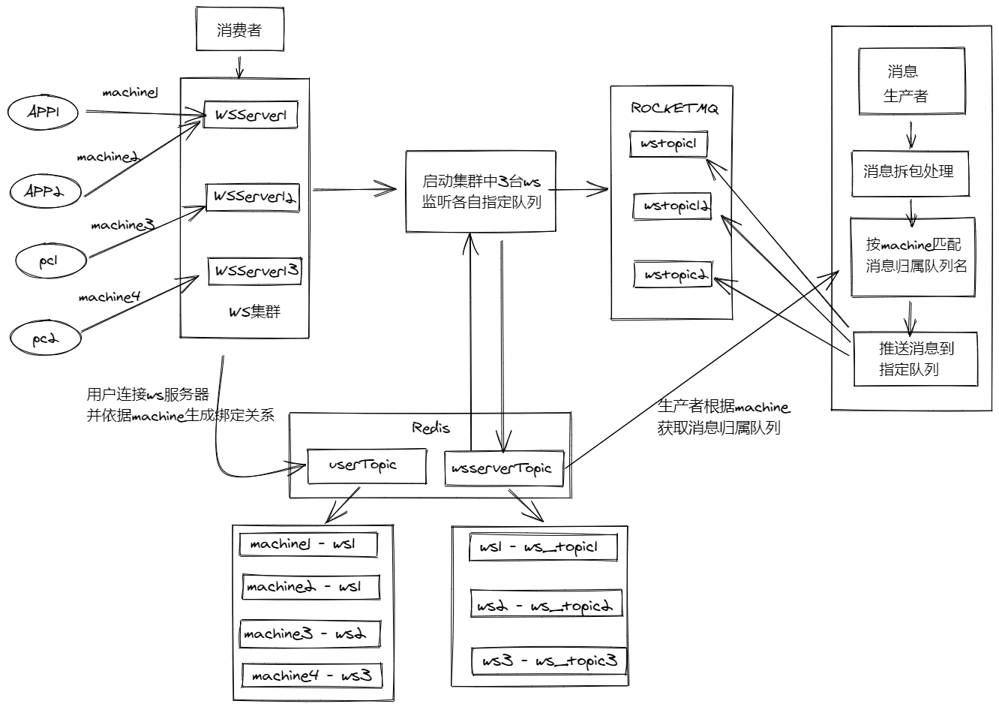
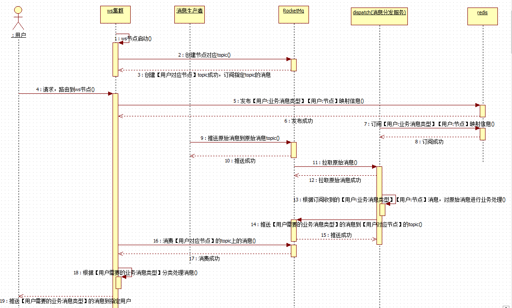

# Websocket集群方案

参与人员：Elinx

初稿时间：2021-07-13

## 版本

|  # | 版本  | 时间  |
| ------------ | ------------ | ------------ |
| 1 |  v1.0.1  | 2021-07-13  |

## 方案背景

由于目前项目属于单机模式运行websocket，客户端与websocket服务端直接，消息的上行和下行都由一个服务处理，随着连接数以及消息量级的上升，必然面临服务器性能瓶颈，如连接数不在上升，消息处理能力大幅度下降，导致消息延迟下发甚至丢失消息。同时，未来架构上基本都会需要集群模式，故而通过研究几种集群方案，并结合业务，提前以下一种符合业务（广播消息）的集群架构方案，提供参考。
注：由于websocket的session会话是不能通过redis来序列化的，所以不能直接利用redis来存在连接信息来进行集群部署（但可以使用redis订阅与发布功能，这里使用rocketmq）。

## 流程详细说明

基于rocketmq队列的发布订阅来实现消息下发

**前提**

假定集群节点数3个；每个集群节点都具备功能：websocket服务，队列消费；每个节点在创建的时候都会主动监听消费一个队列（队列名的生成来源方案有两个）；
采用消息中间件 rocketmq 作为消息转发服务。

**流程**

1.启动websocket集群节点ws1，获取队列名称ws_topic1并监听此队列，生成服务器-服务器队列名称表table1,并定义节点队列名关系为：ws1 - ws_topic1；依次启动另外两台，分别关系为：ws2 - ws_topic2，ws3 - ws_topic3；此关系用于消息广播反向查询到topic名称用于匹配推送消息到指定队列里面。
2.使用四个客户端连接websocket集群，创建用户-服务器关系表生成一份订阅websocket的主题关系，定为 machine_1 - ws1，machine_2 - ws1，machine_3 - ws2，machine_4 - ws3；分别为客户端订阅服务器关系，如machine_1 - ws1代表一个客户端订阅了machine1主题并关联ws1服务器，表定义为table2，客户端的在线离线都去维护这份表，同时每个关系具备生命周期，由socket心跳来更新其时间，由定时任务定时巡查是否剔除过期关系。
3.消息生产者推送消息到ROCKETMQ中，此时做消息推送到指定队列中去，不同的消息推送到不同的队列中，消息中包含农机IOT订阅主题名称，分析名称获取到machine_1，再根据队列名称去第二步中的用户服务器关系表table2，依据table2获取到服务器ws1,再依据ws1去table1获取到ws_topic1，匹配次队列名，推送消息到此队列。其它消息推送等同。
4.websocket服务启动会自动监听消费指定队列，故消息推送过来直接消费并且下发到客户端。

### 队列名来源方案

**方案1**

启动websocket服务时，根据IP+端口号来匹配一个队列名称，匹配列表来源于维护的队列表，队列表提前生成，并存储于缓存或数据库。改方案简单有效，可以直接获取指定的队列名，无需去维护队列表中各个队列的生命周期。

**方案2**

启动websocket服务时，随机从匹配列表中获取一个队列名，并标记被使用，列表来源于维护的队列表，队列表提前生成，并存储于缓存或数据库。此方案需要维护队列表的各个队列名的生命周期，每个节点断线，上线都要更新队列表的标记，维持节点队列名有效。（图略）

## 方案流程图

## 时序图

